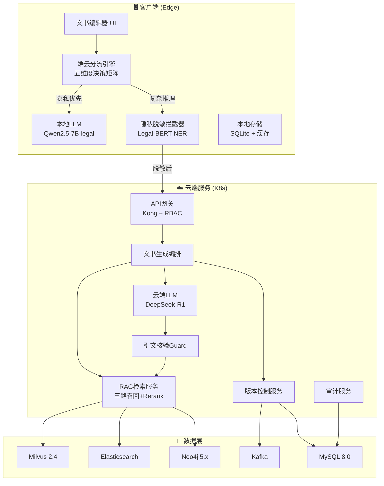
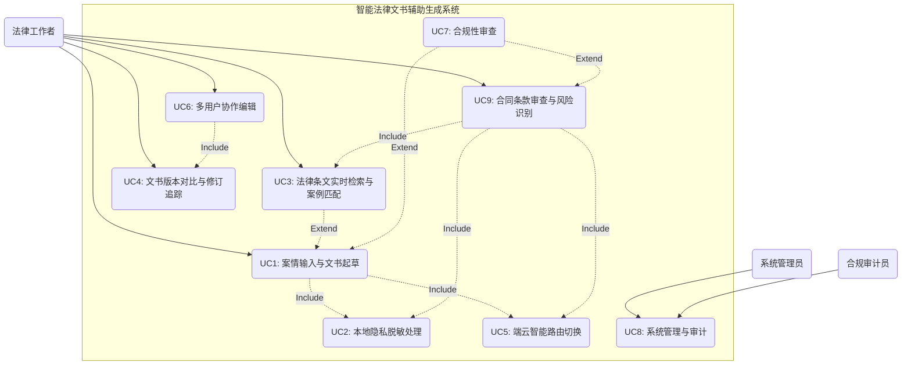
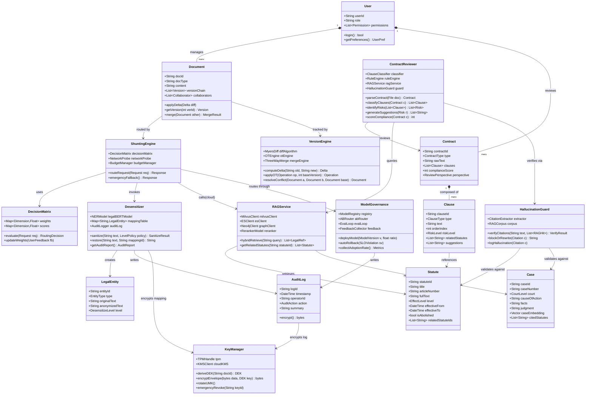
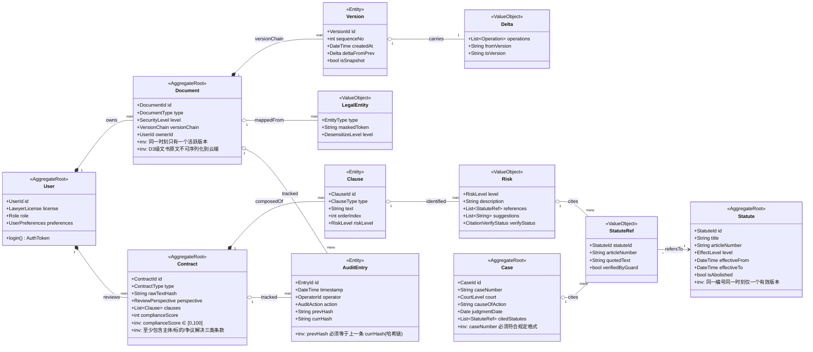
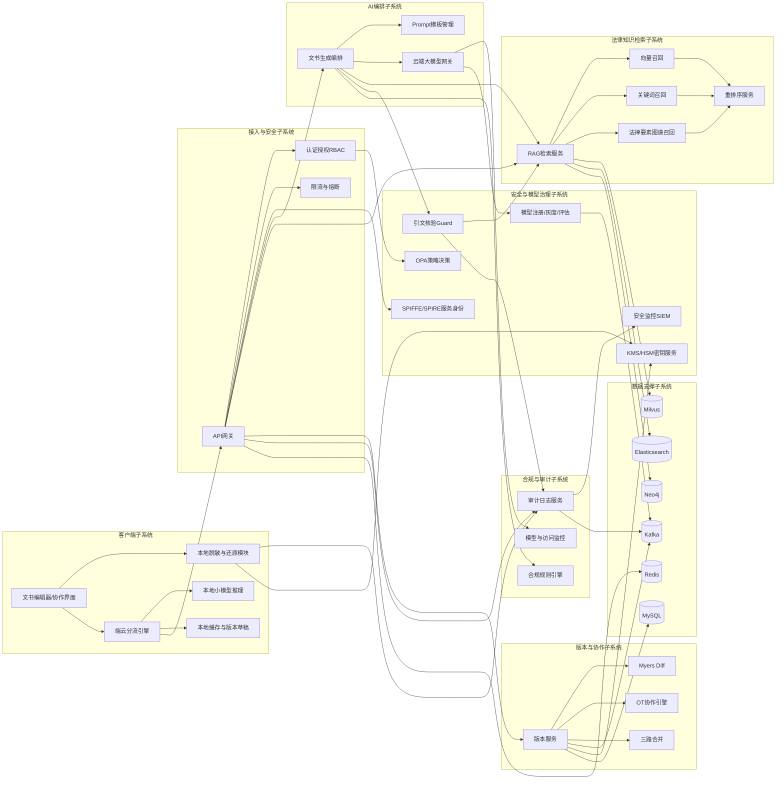
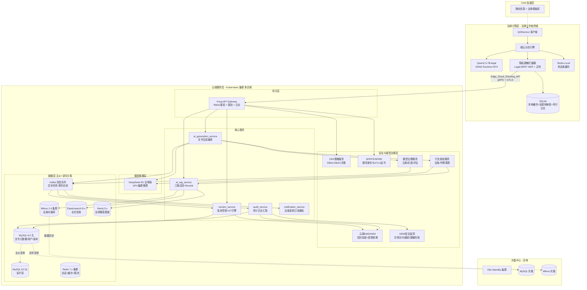
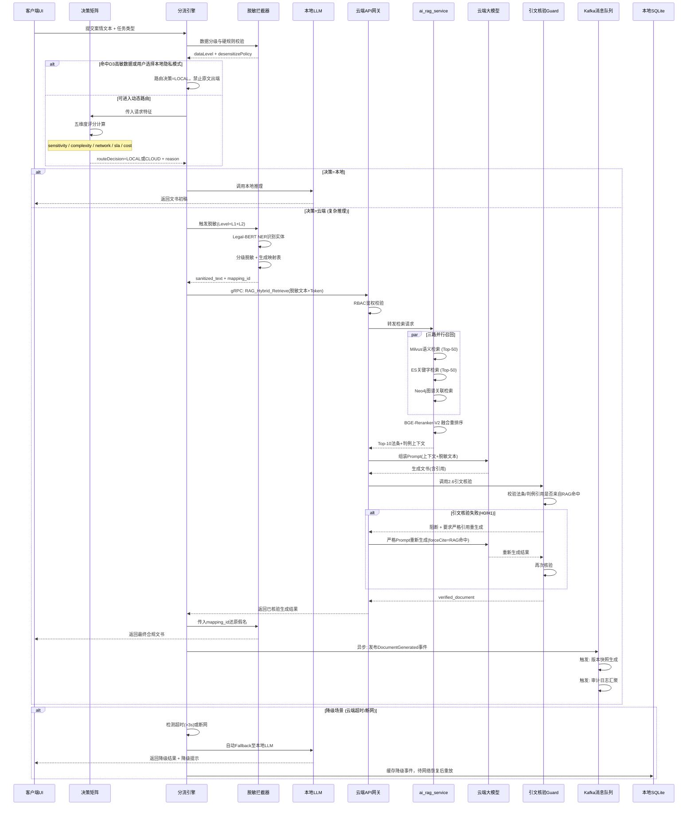
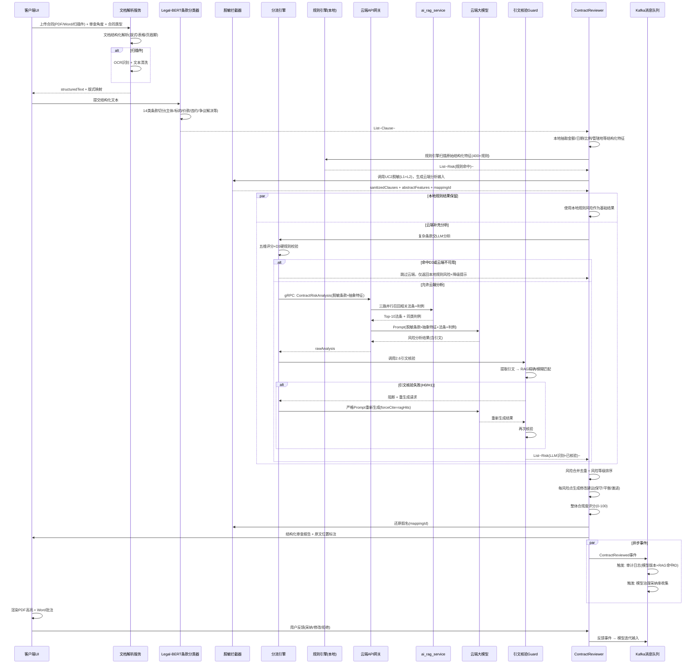

# 智能法律文书辅助生成系统 — 架构设计报告

> **课程**：软件体系结构 | **题目**：01 — 智能法律文书辅助生成系统

---

## 目录

- [00. 摘要](#00-摘要)
- [01. 架构风格对比](#01-架构风格对比)
- [02. 核心机制](#02-核心机制已优化)
  - [2.1 端云智能切换与分流机制](#21-端云智能切换与分流机制-optimized)
  - [2.2 法律条文检索增强引擎](#22-法律条文检索增强引擎-optimized)
  - [2.3 文书版本对比与追踪](#23-文书版本对比与追踪-optimized)
  - [2.4 敏感信息脱敏处理](#24-敏感信息脱敏处理-optimized)
  - [2.5 安全架构与合规框架](#25-安全架构与合规框架-new)
  - [2.6 模型治理与幻觉防控](#26-模型治理与幻觉防控-new)
- [03. 核心组件选型对比](#03-核心组件选型对比-expanded)
- [04. 技术视图（4+1 视图）](#04-技术视图41-视图enhanced)
  - [4.1 用例图 + 详细说明](#41-用例图--详细说明)
  - [4.2 核心类结构图](#42-核心类结构图-enhanced)
  - [4.3 子系统（组件）关系图](#43-子系统组件关系图-added)
  - [4.4 系统部署图](#44-系统部署图-enhanced)
  - [4.5 端云交互时序图](#45-端云交互与智能分流时序图-enhanced)
  - [4.6 合同审查时序图](#46-合同审查时序图uc9-added)
- [05. 非功能性需求量化指标](#05-非功能性需求量化指标-expanded)
- [06. 架构决策记录 (ADR)](#06-架构决策记录-adr-expanded)
- [07. AI 使用声明与反思](#07-ai-使用声明与反思)
- [附录A. 核心模块可运行Demo说明](#附录a-核心模块可运行demo说明)

---

## 00. 摘要

本项目旨在为法律工作者设计一款基于大语言模型（LLM）的**合同审查与文书生成工具**。系统重点解决法律场景下的隐私合规、端云协同以及检索增强（RAG）等核心问题。为满足隐私保护与高精度生成的双重需求，本系统采用"**本地小模型+云端大模型**"的协同架构。

### 系统全局架构概览



### 本次优化说明

基于《2026-SA-大作业题目与要求》对选题01（智能法律文书辅助生成系统）的任务需求，对原架构进行了以下关键优化：

| # | 优化项 | 原方案 | 优化后 |
|---|--------|--------|--------|
| 1 | 端云分流引擎 | 单一置信度阈值(≥85%) | 五维度加权决策矩阵（数据敏感度、任务复杂度、网络质量、实时性SLA、成本预算） |
| 2 | 法律检索 | 双路召回(Milvus+ES) | 三路召回+法律要素图谱+Rerank重排序 |
| 3 | 版本追踪 | Myers差分增量存储 | Myers差分+OT操作转换+三路合并冲突解决+定期Snapshot |
| 4 | 隐私脱敏 | 正则+轻量NLP | 多级脱敏策略(L0-L3)+ Legal-BERT NER上下文感知 + 审计日志 |
| 5 | 量化指标 | 仅有延迟和安全性 | 补充吞吐量(≥100并发/≥50QPS)、可用性(≥99.9%/关键≥99.99%) |
| 6 | 组件选型 | 部分覆盖 | 补充消息队列、API协议、LLM部署方式、数据库完整对比表 |
| 7 | 用例说明 | 仅标题列表 | 每个一级用例含详细输入/输出/实现逻辑 |
| 8 | 子系统关系 | 缺少独立组件依赖视图 | 增加子系统关系图，明确客户端、RAG、版本、审计、模型网关和数据层依赖 |
| 9 | 部署图 | 基础部署 | 增加多区域灾备、边缘计算节点、CDN加速层 |
| 10 | ADR | 3个基本决策 | 扩展至5个标准化ADR，增加ADR-004(脱敏)和ADR-005(API协议) |
| 11 | 业务用例 | 仅文书生成主线 | 新增UC9合同条款审查独立用例（题目第一要求"合同审查"），含条款抽取/风险识别/法条对照/修改建议 |
| 12 | 安全架构 | 仅脱敏一节覆盖 | 新增2.5节零信任架构+IAM/RBAC/ABAC+密钥分层+国密支持+合规映射+应急响应 |
| 13 | 模型治理 | 完全未覆盖 | 新增2.6节引文核验+模型灰度+评估闭环+采纳率监控+偏见检测，将法律幻觉率从~15-20%压制到<2% |
| 14 | ADR扩展 | 5个ADR | 增加ADR-006(安全架构与国密)、ADR-007(模型幻觉防控)，达到7个 |

### 课程要求覆盖矩阵

| 课程要求 | 本报告对应章节 | 覆盖说明 |
|----------|----------------|----------|
| 两种备选架构风格与对比 | 01. 架构风格对比 | 对比微服务与事件驱动，并给出混合架构选择理由 |
| 法律条文实时检索与案例匹配 | 2.2、4.1 UC3、4.2/4.3 | 三路召回、法律要素图谱和Rerank精排 |
| 文书版本对比与修订追踪 | 2.3、4.1 UC4/UC6、4.2 | Myers Diff、OT协作、三路合并和快照机制 |
| 敏感信息脱敏处理 | 2.4、4.1 UC2、ADR-004 | 本地Legal-BERT NER、多级脱敏、脱敏审计 |
| 本地小模型与云端大模型动态选择 | 2.1、4.5、ADR-001 | 策略硬规则、五维评分和降级路径 |
| 非功能需求量化与场景适应性 | 05. 非功能性需求量化指标 | 延迟、吞吐量、可用性、安全和弱网/高并发适配 |
| 关键技术组件选型对比 | 03. 核心组件选型对比 | 数据库、消息队列、API协议、LLM部署方式 |
| 技术视图 | 04. 技术视图 | 用例图、类图、子系统关系图、部署图、时序图 |
| 设计决策记录 | 06. ADR | 7个关键决策点，含备选方案、依据、选择和代价 |
| AI使用声明与反思 | 07. AI 使用声明与反思 | 说明AI生成内容、采纳/未采纳建议与局限 |
| 合同审查独立流程（题目第一要求） | 4.1 UC9 | 文档解析、条款分类、双引擎风险识别、法条/判例对照、修改建议 |
| 安全架构与等保三级目标/国密适配 | 2.5、ADR-006 | 零信任、IAM、密钥分层、国密SM2/SM3/SM4适配、合规映射、应急响应 |
| LLM治理与幻觉防控（法律行业关键风险） | 2.6、ADR-007 | 引文强制核验、模型版本灰度、评估金标准集、用户反馈闭环、偏见检测 |

---

## 01. 架构风格对比

### 备选架构风格

为了支撑系统的复杂业务场景，我们对比了两种备选架构风格：

#### 方案A：微服务架构 (Microservices Architecture)

**优势：** 通过将RAG检索、版本控制、大模型网关等拆分为独立服务，具备极高的可扩展性和清晰的业务边界。每个服务可独立部署、独立扩缩容，技术栈可按需选择。

**劣势：** 服务间通信开销大（网络延迟累加），运维复杂度高（需K8s+服务网格），分布式事务难保证，且对网络稳定性有强依赖。

#### 方案B：事件驱动架构 (Event-Driven Architecture)

**优势：** 高度解耦，非常适合处理长耗时的LLM推理任务和文档版本比对等异步操作。天然支持削峰填谷，系统韧性更强。

**劣势：** 控制流不直观（异步回调链难以追踪），调试困难，难以保证法律文书生成中的强一致性事务（如合同条款间的前置依赖校验）。

#### 对比分析矩阵

| 评估维度 | 微服务架构 | 事件驱动架构 |
|----------|-----------|-------------|
| 业务边界 | 清晰（按领域拆分）★★★★★ | 模糊（事件流贯穿）★★★ |
| 实时性 | 强（同步API调用）★★★★★ | 弱（异步消费）★★ |
| 可扩展性 | 高（独立扩缩）★★★★ | 极高（天然解耦）★★★★★ |
| 运维复杂度 | 高（多服务治理）★★ | 极高（事件溯源维护）★ |
| 事务一致性 | 可保证（Saga/TCC）★★★★ | 难以保证 ★★ |
| LLM长耗时任务 | 需额外处理（超时/重试）★★★ | 天然适配 ★★★★★ |

#### 结论与融合

系统最终采用 **"以微服务为主，局部结合事件驱动"** 的混合架构：

- **同步微服务调用**（核心交互）：合规审查、RAG检索、脱敏处理 → 保证实时性与一致性
- **事件驱动异步处理**（长耗时任务）：复杂文书生成、版本增量同步 → 通过Kafka实现削峰填谷和异步解耦

---

## 02. 核心机制（已优化）

### 2.1 端云智能切换与分流机制 [OPTIMIZED]

**优化要点：** 原方案仅基于单一置信度(≥85%)做决策，优化为"策略硬规则 + 五维度加权评分 + 数据分级流转"。这样既能满足用户动态选择模型的要求，也能避免敏感原文因评分误判而上传云端。

#### 数据分级与流转边界

| 数据等级 | 数据示例 | 默认处理位置 | 是否允许出端 | 说明 |
|----------|----------|--------------|--------------|------|
| D0 公开数据 | 法条编号、公开判例号、文书模板编号 | 云端/本地均可 | 允许 | 可参与云端RAG检索与缓存 |
| D1 业务低敏数据 | 合同类型、争议焦点、抽象案情标签 | 本地预处理后云端可用 | 允许 | 需去除当事人身份信息 |
| D2 个人/商业敏感数据 | 当事人姓名、公司名称、合同金额、住址 | 本地 | 脱敏后允许 | 上传前必须完成L1/L2脱敏 |
| D3 高敏数据 | 身份证号、银行账号、未公开证据、律师意见原文 | 本地 | 禁止 | 只能由本地模型、规则引擎和本地缓存处理 |

**数据分流原则：**

1. 原始文书、D2/D3实体映射表、脱敏还原密钥只保留在客户端本地安全区。
2. 云端只接收脱敏文本、检索查询向量、公开法条/判例ID和必要的任务元数据。
3. 云端返回的生成结果先在客户端进行敏感实体还原、规则校验和版本入库，再展示给用户。
4. 用户手动选择云端模式时，仍必须经过本地脱敏策略校验；D3数据命中时禁止上传并提示原因。

#### 路由策略硬规则

| 优先级 | 规则 | 路由结果 | 设计理由 |
|--------|------|----------|----------|
| P0 | 命中D3高敏数据 | 强制本地 | 隐私合规优先于模型精度，D3数据禁止出端 |
| P1 | 网络断开、云端熔断或云端超预算 | 强制本地/规则模板 | 保证核心功能可用 |
| P2 | 用户明确选择本地隐私模式 | 强制本地 | 尊重律师工作场景的保密要求 |
| P3 | 用户明确选择云端高精度模式且脱敏通过 | 进入云端评分 | 保留动态选择能力 |
| P4 | 无硬规则命中 | 进入五维度评分 | 在体验、成本、精度之间平衡 |

#### 五维度决策矩阵

| 决策维度 | 权重 | 本地小模型适用条件 | 云端大模型适用条件 | 评估方法 |
|----------|------|-------------------|-------------------|----------|
| 数据敏感度 | 30% | 含PII/商业秘密数据 | 已脱敏或公开数据 | NLP敏感词扫描+正则匹配 |
| 任务复杂度 | 25% | 简单合同起草/模板填充 | 复杂条款推理/多法条交叉 | LLM复杂度分类器(本地) |
| 网络质量 | 20% | RTT>500ms或丢包率>5% | RTT<100ms且带宽充足 | 网络探测定时检测 |
| 实时性SLA | 15% | 交互式编辑(需<300ms感知延迟) | 批量生成/夜间批处理 | SLA配置表+任务类型标记 |
| 成本预算 | 10% | 低成本/免费额度 | 有云端预算配额 | Token计数器+预算管理器 |

#### 决策算法（伪代码）

```
function routeRequest(request):
    dataLevel = classifyData(request.content)
    if dataLevel == D3:
        return routeTo(LOCAL_LLM, reason="D3 data cannot leave device")
    if request.userMode == "LOCAL_PRIVACY" or cloudUnavailable():
        return routeTo(LOCAL_LLM)

    sanitized = desensitizeIfNeeded(request.content, dataLevel)
    scores = {
        sensitivity: evaluateSensitivity(request.content),    // 0-100, 越高越倾向本地
        complexity:  evaluateComplexity(sanitized.text),      // 0-100, 越高越倾向云端
        network:     probeNetworkQuality(),                   // 0-100, 越高越倾向云端
        sla:         checkSLA(request.taskType),              // 0-100, 越高越倾向本地(低延迟)
        cost:        checkBudget(request.userId)              // 0-100, 越高越倾向云端(有预算)
    }
    
    localScore  = scores.sensitivity * 0.30 
                + scores.sla * 0.15 
                + (100 - scores.network) * 0.20
                + (100 - scores.cost) * 0.10
    cloudScore  = scores.complexity * 0.25 
                + scores.network * 0.20 
                + scores.cost * 0.10
                + (100 - scores.sensitivity) * 0.30
    
    if localScore >= cloudScore:
        return routeTo(LOCAL_LLM)
    else:
        return routeTo(CLOUD_GATEWAY, sanitized.text, sanitized.mappingId)
```

> **可运行实现：** 上述决策算法的完整 Python 实现见 `src/shunting_engine.py`，包含 `DecisionMatrix` 五维度评分、`ShuntingEngine` P0~P4 硬规则路由、`CloudStatus` 熔断器和三层降级策略。运行 `python -m src.shunting_engine` 可查看5种典型场景的路由决策过程。

#### 用户动态选择交互流程 [NEW]

**优化要点：** 题目进阶约束明确"用户可动态选择"两种模式，原方案仅在硬规则中描述"用户明确选择"，缺少 UI 交互层面的"何时选择、如何选择、选择冲突如何处理"完整流程。本节补全用户决策交互链路。

##### 三种交互入口

| 入口 | 触发时机 | UI 表现 | 默认行为 |
|------|---------|--------|---------|
| **全局模式开关** | 进入工作区时一次性设置 | 顶栏 Segmented Control（智能/本地隐私/云端高精度 三档） | 智能（系统决策） |
| **任务级覆盖** | 单次任务提交前 | 提交按钮旁的"⚡仅本地 / ☁️用云端"快捷切换 | 跟随全局模式 |
| **系统推荐反向选择** | 系统推荐后 UI 提示路由结果 | "本次将使用云端处理" + "切换到本地"按钮 | 5s 内无操作则按推荐执行 |

##### 用户选择 vs 系统推荐冲突处理

```mermaid
flowchart TD
    Start([用户提交任务]) --> CheckMode{用户全局/任务级<br/>选择模式?}
    
    CheckMode -->|智能(默认)| AutoRoute[五维度评分自动路由]
    CheckMode -->|强制本地| LocalCheck{本地能力是否可用?}
    CheckMode -->|强制云端| CloudCheck{脱敏校验通过?<br/>无D3硬命中?}
    
    AutoRoute --> ShowReason[UI显示路由结果<br/>+'切换'按钮 5s倒计时]
    ShowReason --> UserOverride{用户在5s内<br/>主动切换?}
    UserOverride -->|否| Execute[按推荐执行]
    UserOverride -->|是| ConflictCheck{用户选择与<br/>硬规则冲突?}
    
    LocalCheck -->|可用| Execute
    LocalCheck -->|不可用<br/>(模型未加载/低端机)| Fallback[降级提示+<br/>规则模板兜底]
    
    CloudCheck -->|通过| Execute
    CloudCheck -->|D3命中| ForceBlock[弹窗:<br/>'检测到身份证号等高敏数据,<br/>已强制本地处理']
    CloudCheck -->|脱敏失败| ForceBlock2[弹窗:<br/>'敏感字段无法脱敏,<br/>已强制本地处理']
    
    ConflictCheck -->|无冲突| Execute
    ConflictCheck -->|D3命中| ForceBlock
    ConflictCheck -->|断网/熔断| FallbackCloud[提示:<br/>'云端不可用,<br/>已切换本地']
    
    ForceBlock --> Execute
    ForceBlock2 --> Execute
    FallbackCloud --> Execute
    Fallback --> Execute
    Execute --> End([返回结果<br/>UI右下角显示<br/>实际路由+耗时])
```

##### 决策冲突的 UI 透明化原则

| 原则 | 实现 | 用户感知 |
|------|------|---------|
| **可见性** | 每次结果显示实际使用路径（"本地推理 1.2s" / "云端推理 1.8s"） | 用户始终知道数据走向 |
| **可解释** | 路由决策附带原因 tooltip（如"复杂度高+网络好→云端推荐"） | 减少黑盒感 |
| **可覆盖** | 任意时刻一键切换，无需重新输入案情 | 尊重用户最终决策权 |
| **强制阻断有理由** | D3 阻断弹窗必须明确告知"何字段命中何分级" | 满足《个保法》知情权要求 |
| **无声降级有提示** | 网络降级/熔断必须有 Toast 提示，不静默 fallback | 用户感知系统状态 |

##### 用户偏好学习

| 学习维度 | 数据采集 | 调权方式 |
|---------|---------|---------|
| 用户主动切换率 | 记录"系统推荐 vs 用户最终选择"的差异 | 切换率 >30% 触发权重微调 |
| 任务类型偏好 | 同一用户在合同/起诉状/法律意见书的模式偏好 | 任务类型→默认模式映射表 |
| 时段偏好 | 律师工作时段 vs 夜间批处理时段 | SLA 维度权重动态调整 |
| 拒绝结果归因 | 用户拒绝采纳的归因（"不够细致"→倾向云端） | 反馈→质量维度权重 |

#### 增强优雅降级策略（三层降级）

| 降级等级 | 触发条件 | 降级策略 | 保证能力 |
|----------|----------|----------|----------|
| Level 1 | 云端首字超时(>3s)或返回429/5xx | 自动切换至本地模型+缓存结果 | 交互不中断，生成质量可能下降 |
| Level 2 | 网络断开 | 启用本地离线模式（本地LLM+本地法条缓存+SQLite） | 文书查看、模板起草、版本对比100%可用 |
| Level 3 | 本地模型负载过高或设备不支持推理 | 降级为规则模板+关键词检索 | 保证系统不崩溃，可完成基础草拟 |

---

### 2.2 法律条文检索增强引擎 [OPTIMIZED]

**优化要点：** 原方案为双路召回(Milvus+ES)，优化为三路召回+法律要素图谱+重排序增强，大幅提升检索精度和案例匹配能力。

#### 三路召回策略

| 召回路径 | 技术组件 | 检索方式 | 适用场景 |
|----------|----------|----------|----------|
| 语义向量召回 | Milvus + BGE-M3 Embedding | Dense向量相似度检索(Top-K=50) | 语义相近的法条/判例发现 |
| 关键词精确召回 | Elasticsearch + BM25 | 法条编号/罪名/刑期等结构化字段精确匹配 | 精确法条定位、编号检索 |
| 知识图谱召回 | Neo4j 法律要素图谱 | 基于法条间引用关系、判例引用链的图遍历 | 关联法条推荐、判例链追溯 |

#### 融合重排序 (Rerank)

三路召回结果（约150条候选）送入 **BGE-Reranker-V2** 进行Cross-Encoder精排，融合法律领域特征：
- 法条效力层级（宪法 > 法律 > 行政法规 > 司法解释）
- 判例法院级别（最高法 > 高院 > 中院）
- 时效性权重（新法优于旧法、最新判例优先）

最终输出 **Top-10** 最相关结果作为LLM上下文。

#### 实时法条更新订阅

通过接入最高人民法院、全国人大等官方公开发布渠道或合规法律数据供应商的更新源，在Elasticsearch和Milvus中实现增量索引更新，保证法律条文检索的时效性（更新延迟<24小时）。

> **可运行实现：** 三路召回 + Rerank 重排序的完整 Python 实现见 `src/rag_service.py`，包含模拟法律知识库（8条法条 + 3个判例）。运行 `python -m src.rag_service` 可查看三路并行召回与融合排序过程。

---

### 2.3 文书版本对比与追踪 [OPTIMIZED]

**优化要点：** 原方案仅基于Myers差分算法进行增量存储，优化后增加OT操作转换支持多人协作编辑，以及三路合并冲突解决机制。

#### 增强版本控制架构

| 层次 | 技术方案 | 功能说明 |
|------|----------|----------|
| 差分计算层 | Myers Diff Algorithm | 计算相邻版本的最小编辑操作序列(Insert/Delete/Replace) |
| 协作同步层 | OT (Operational Transformation) | 多用户并发编辑时，通过操作转换保证最终一致性 |
| 冲突解决层 | Three-Way Merge + 规则引擎 | 基于LCA的三路合并；法律条款冲突时优先采用审级更高或时效更新的版本 |
| 版本存储层 | Delta Chain + Snapshot机制 | 每10个Delta自动生成一个Snapshot，平衡读取性能与存储开销 |

#### 版本控制流程

```
用户编辑 → Myers Diff生成Delta → OT引擎检查并发冲突
    ├── 无冲突 → 直接提交Delta
    └── 有冲突 → 三路合并(当前版本, 提交版本, LCA)
         ├── 可自动合并 → 应用合并结果
         └── 需人工裁决 → 标记冲突区域 → 推送用户确认
```

> **可运行实现：** Myers Diff + OT + 三路合并的完整 Python 实现见 `src/version_engine.py`。运行 `python -m src.version_engine` 可查看多律师并发修改合同的差异对比与冲突合并过程。

---

### 2.4 敏感信息脱敏处理 [OPTIMIZED]

**优化要点：** 原方案仅基于正则+轻量NLP进行PII替换，优化为多级脱敏策略+上下文感知NER+脱敏审计日志。

#### 多级脱敏策略

| 脱敏等级 | 策略 | 适用字段 | 示例 |
|----------|------|----------|------|
| L0-不脱敏 | 原文保留 | 法条引用、公开判例号 | 《民法典》第1043条 → 保留原文 |
| L1-假名化 | 替换为假名，可逆 | 当事人姓名、公司名称 | 张三 → `[PARTY_A]`; 某科技公司 → `[COMPANY_01]` |
| L2-泛化 | 替换为类别标签 | 具体金额、日期范围 | ¥500万 → `[AMOUNT:大额]`; 2024-03-15 → `[DATE:近期]` |
| L3-完全删除 | 移除信息 | 身份证号、银行账号、住址 | 110101199001011234 → `[REDACTED]` |

#### 上下文感知NER增强

基于 **Legal-BERT** 微调的命名实体识别模型，在客户端本地运行，可区分以下法律特定实体类型：

- 当事人（自然人/法人）、律师/法官
- 案号、金额、日期、地点、罪名
- 证据类型、诉讼请求

> 相比纯正则方案，F1-score 从 **~0.75** 提升至 **~0.93**

#### 脱敏审计日志

每次脱敏操作记录：时间戳、操作者ID、脱敏等级、涉及的实体类型和数量。

- 日志使用 **AES-256** 加密存储在本地SQLite
- 支持外部审计接口查询（仅返回统计信息，不泄露原始数据）
- 满足《个人信息保护法》《数据安全法》合规要求

> **可运行实现：** 多级脱敏策略 + NER 模拟的完整 Python 实现见 `src/desensitizer.py`。运行 `python -m src.desensitizer` 可查看法律文书脱敏、还原与审计日志的完整流程。

---

### 2.5 安全架构与合规框架 [NEW]

**优化要点：** 原方案安全能力分散在脱敏、鉴权等局部模块，本次新增独立的安全架构章节，建立"零信任 + 多层加密 + 密钥分层 + 国密适配"的端到端安全体系。该方案按等保2.0三级目标进行设计，并预留在系统被认定为关键信息基础设施或客户明确要求时接入商用密码合规能力。

#### 零信任架构 (Zero Trust)

| 安全原则 | 实现方式 | 关键技术 |
|---------|---------|---------|
| 永不信任，持续验证 | 每次API调用均做身份+设备+上下文鉴权 | mTLS + JWT + 设备指纹 |
| 最小权限 | 基于RBAC+ABAC的动态权限决策 | OPA (Open Policy Agent) |
| 微分段 | 服务间网络隔离，默认拒绝东西向流量 | K8s NetworkPolicy + Istio |
| 端到端加密 | 客户端→网关→服务→数据库全链路加密 | TLS 1.3 / mTLS / 字段级加密 |
| 全量审计 | 所有访问/操作不可篡改地记录 | 哈希链审计日志 + WORM存储 |

#### 身份与访问控制 (IAM)

**多维身份体系：**
- **自然人身份**：律师执业证号 + 手机号 + 二次认证（短信/TOTP/生物识别）
- **设备身份**：设备指纹 + TPM 2.0/Secure Enclave 绑定的设备证书
- **服务身份**：SPIFFE/SPIRE 分发的 SVID 证书，自动轮换（默认 1 小时）

**分层权限模型：**

| 层级 | 模型 | 适用场景 | 实现 |
|------|------|---------|------|
| 粗粒度 | RBAC | 角色级权限（律师/合伙人/助理/审计员/管理员 五级） | 内置角色表 |
| 细粒度 | ABAC | 文书级权限（基于客户、案件、密级、时间窗） | OPA Rego 策略 |
| 动态决策 | Policy as Code | 复杂业务规则（如"主办律师离职后文书自动转交合伙人"） | OPA + 配置中心热更新 |

#### 密钥管理分层架构 (KMS)

| 层级 | 密钥类型 | 存储位置 | 用途 | 轮换策略 |
|------|---------|---------|------|---------|
| L1 | 设备主密钥 (DMK) | TPM 2.0 / Secure Enclave / Keychain | 包封上层密钥 | 设备生命周期 |
| L2 | 用户主密钥 (UMK) | 由 DMK 加密后存本地 | 派生文书密钥 | 用户主动轮换（≥1年） |
| L3 | 文书加密密钥 (DEK) | 由 UMK 加密，每文书独立 | 文档/字段级加密 | 每次重大编辑 |
| L4 | 云端KMS主密钥 | 阿里云KMS / HSM | 云端数据信封加密 | 90天自动轮换 |

**关键流程：**
1. 设备注册：TPM 内生成密钥对，公钥上送 KMS 备份；私钥永不出 TPM
2. 跨设备同步：UMK 由口令 + 设备绑定双因子派生（KDF=Argon2id）
3. 云端调用：mTLS 握手用 SPIFFE 证书，业务数据二次包封（信封加密）

#### 国密算法支持

按等保2.0三级目标和商用密码合规场景预留国密能力；若部署环境被认定为关键信息基础设施或客户合规要求明确，则启用通过认证的国密产品和算法套件：

| 用途 | 国密算法 | 通用算法（备选/海外部署） |
|------|---------|------------------------|
| 非对称加密/数字签名 | SM2 | RSA-2048 / ECDSA-P256 |
| 哈希 | SM3 | SHA-256 |
| 对称加密 | SM4-GCM | AES-256-GCM |
| TLS套件 | ECDHE-SM2-WITH-SM4-GCM-SM3 | TLS_AES_256_GCM_SHA384 |

**实现技术栈：** 客户端集成 GmSSL，服务端使用 Tongsuo（铜锁，蚂蚁开源国密库），与现有 OpenSSL 生态兼容。

#### 数据加密策略（静态 + 传输）

| 数据状态 | 加密方式 | 密钥来源 |
|---------|---------|---------|
| 传输中-外部 | TLS 1.3（国密TLS可选） | Let's Encrypt / 自签 |
| 传输中-内网 | mTLS（gRPC） | SPIFFE/SPIRE |
| 静态-端侧文书 | SM4-GCM 字段级加密 | TPM-DMK → DEK |
| 静态-MySQL | TDE 透明数据加密 + 敏感字段二次加密 | 阿里云 KMS |
| 静态-向量库 | Milvus 原文密文存储，索引明文 | KMS 派生 |
| 备份-OSS | 客户端加密(CSEK) + OSS 服务端加密 | UMK + KMS 双重 |

#### 密钥泄露与安全事件应急响应

| 等级 | 触发条件 | 响应动作 | RTO |
|------|---------|---------|-----|
| P0 | 云端KMS主密钥疑似泄露 | 立即吊销 + 全量数据二次加密 + 用户通知 + 监管报备 | 4h |
| P1 | 用户UMK泄露 | 该用户文书强制重加密 + 设备解绑 + 二次认证 | 1h |
| P2 | 服务SVID证书泄露 | SPIRE自动吊销 + 下发新证书 + 服务重启 | 5min |
| P3 | 设备丢失/被盗 | 用户上报 → TPM远程擦除 → 设备拉黑 | 用户触发 |

#### 合规映射表

| 法规/标准 | 关键要求 | 本架构对应实现 |
|----------|---------|---------------|
| 《个人信息保护法》 | 最小化收集、本地化、知情同意、个人信息保护影响评估(PIA) | D0-D3数据分级 + 本地脱敏 + 同意日志 + 年度PIA报告 |
| 《数据安全法》 | 数据分类分级、风险评估、定期审计 | 数据分级表 + 季度渗透测试 + 红蓝对抗 |
| 《律师法》及《律师执业管理办法》 | 当事人保密义务、文书归档≥7年 | 密文存储 + 不可篡改审计链 + 7年合规归档 |
| 等保2.0三级 | 身份鉴别、访问控制、安全审计、入侵防范、密码管理 | 双因子 + RBAC/ABAC + 全量审计 + WAF/IDS + 国密 |
| 《商用密码管理条例》及配套规定 | 关键信息基础设施和特定行业场景需按要求使用商用密码 | SM2/SM3/SM4 可配置支持 + 国密认证产品适配 |
| 《网络安全审查办法》 | 数据出境评估 | 默认境内处理 + 跨境单独审批与影响评估 |

#### 安全监控与红蓝对抗

- **SIEM**：ELK + Sigma 规则，覆盖登录异常、越权访问、批量导出、脱敏失败、异常路由请求
- **威胁情报**：集成微步在线/奇安信威胁情报源，实时阻断恶意IP/域名
- **红蓝对抗**：季度演练，重点场景包括"敏感数据外泄"、"权限提升"、"模型逆向攻击"、"供应链投毒"
- **漏洞管理**：SAST(SonarQube) + DAST(OWASP ZAP) + SCA(Snyk) 三位一体，CI 流水线强制门禁

---

### 2.6 模型治理与幻觉防控 [NEW]

**优化要点：** 法律 LLM "伪造法条、虚构判例" 是行业核心风险（多国已有律师援引 AI 虚假判例被法院处罚的真实案例）。本节建立 "引文强制核验 + 模型版本灰度 + 评估闭环 + 反馈学习" 的全链路治理体系，将开放域 ~15-20% 的幻觉率在法律领域压制到 **<2%**。

#### 法律幻觉风险分级与防控策略

| 等级 | 幻觉类型 | 业务影响 | 防控策略 |
|------|---------|---------|---------|
| H0 致命 | 伪造法条编号或全文 | 律师向法院提交伪造法律意见，触及执业风险 | 引文强制核验 + 输出阻断 + 异常上报 |
| H1 严重 | 虚构判例号或案件事实 | 误导诉讼策略 | 判例号白名单 + 真实性二次校验 |
| H2 中等 | 法条引用错误（条款编号偏移） | 法律意见有瑕疵 | RAG对照 + 置信度可视化提示 |
| H3 轻微 | 措辞不规范、用语口语化 | 文书质量下降 | 法律术语词典后处理 + 风格化Prompt |

#### 引文核验机制 (Citation Verification)

**核心原则：** 模型输出中所有的法条引用、判例引用必须 **100% 可溯源**到 RAG 命中的真实条目，否则强制阻断或降级输出，禁止"自由发挥"。

**核验算法（伪代码）：**

```
function verifyCitations(generatedText, ragHits):
    citations = extractCitations(generatedText)   // NER抽取所有"《XXX》第N条"和判例号
    verifiedText = generatedText
    
    for citation in citations:
        if exactMatchInRAG(citation, ragHits):
            continue   // 精确命中，通过
        else if fuzzyMatchInRAG(citation, ragHits, threshold=0.95):
            verifiedText = rewriteToCanonical(verifiedText, citation, fuzzyMatchedItem)
            logWarning(citation, "已自动纠正为权威表述")
        else:
            blockOutput(reason="存在未核验引用: " + citation)
            logHallucination(citation)
            return regenerateWithStrictPrompt(forceCite=ragHits)
    
    return verifiedText
```

> **可运行实现：** 引文核验算法的完整 Python 实现见 `src/citation_guard.py`，包含精确匹配、Levenshtein 模糊匹配和幻觉分级阻断。运行 `python -m src.citation_guard` 可查看正常引用通过、虚构法条/判例阻断的完整演示。

**核验粒度：**
1. 法条编号精确匹配（《民法典》第1043条 ↔ RAG命中ID）
2. 法条全文片段 Levenshtein 距离 ≤ 5%
3. 判例号格式校验（如"(2023)最高法民终123号"格式合法 + 数据库存在）
4. 时效性校验（被引法条是否已废止/被新法替代）

#### 模型版本治理

| 治理维度 | 实施方式 |
|---------|---------|
| 版本注册 | 每个上线模型版本登记：训练数据版本、评测分数、发布时间、审批人、Hash指纹 |
| 灰度发布 | Istio 按用户分桶: 1%→5%→20%→50%→100%，每阶段观察 24h |
| A/B 测试 | 同请求双模型并发推理，业务侧记录用户最终采纳版本 |
| 自动回滚 | SLO 违例（采纳率下降>10%、幻觉率>3%、P99延迟>3s）触发自动回滚 |
| 模型审计 | 每季度第三方法律专家盲测 + 抽样审查输出质量（≥1000份/季度） |
| 退役流程 | 旧版本保留 3 个月只读，便于历史文书复核与责任追溯 |

#### 评估闭环 (Evaluation Loop)

**评测金标准集 (Golden Set)：**
- 1000+ 条法律实务问题，覆盖民商事/刑事/行政三大领域
- 每题由 3 名资深律师独立标注标准答案 + 评分细则
- 每季度更新 10%，反映最新法律修订与重要判例

**自动评测指标：**

| 指标 | 定义 | 目标值 |
|------|------|-------|
| 法条引用准确率 | 引用法条与标准答案一致比例 | ≥98% |
| 判例引用真实性 | 判例号在数据库存在的比例 | =100% |
| 法律推理正确率 | LLM-as-Judge（Claude/GPT-4o）评分均值 | ≥85% |
| 文书规范度 | 与司法部范文模板的格式相似度 | ≥90% |
| 幻觉发生率 | 包含未核验引用的输出占比 | <2% |
| 时效性合规率 | 引用法条非废止/有效的比例 | ≥99.5% |

#### 用户反馈与采纳率监控

**显式反馈：**
- 每次生成后用户标记：采纳/部分采纳/拒绝 + 原因（过于通用/法条错误/逻辑错误/格式问题）
- 数据写入 Kafka → 流入数仓 → 周报汇总 → 模型迭代输入

**隐式反馈：**
- 用户在生成结果上的编辑距离（编辑越少 → 质量越高）
- 用户最终提交版本与 AI 初稿的相似度
- 跨会话复用率（被复制/引用次数）

**反馈闭环用途：**
1. RLHF/DPO 微调本地小模型（季度迭代）
2. Prompt 模板优化（周度迭代，基于失败用例）
3. RAG 召回策略调优（月度迭代，基于召回缺失案例）
4. 路由决策权重调整（实时学习，基于用户主动切换记录）

#### 偏见与公平性检测

法律 AI 偏见可能体现在性别/地域/经济地位等保护属性上的判决预测偏差，及训练数据时代偏差（老旧判例反映过时观念）。

**检测方式：**
- **反事实公平性测试**：同一案情，仅替换性别/地域/民族，观察输出差异，差异率 ≤ 3%
- **对抗样本测试**：季度收集对抗样本入测评集
- **透明度报告**：年度发布模型偏见检测报告，含具体测试用例

#### 用户提示与免责设计

**强制性 UI 提示：**
- 所有 AI 生成内容标注 **"AI辅助生成，需律师专业审核"**
- 引文置信度可视化（高置信绿色 / 中等黄色 / 需核验红色 三色标注）
- 复杂法律推理结论显示依据链与摘要说明，便于律师复核逻辑，但不暴露完整内部推理链

**审计追溯：**
- 每份 AI 输出文书绑定：模型版本号 + RAG 命中条目 ID 列表 + 生成时间 + 输入摘要哈希
- 律师可随时调取生成依据，作为执业留痕（满足律师行业留痕要求）
- 一旦法律责任纠纷，可完整还原 AI 决策路径

---

## 03. 核心组件选型对比 [EXPANDED]

### 3.1 消息队列选型对比

| 组件 | 吞吐量 | 延迟 | 持久化 | 生态集成 | 选型结论 |
|------|--------|------|--------|----------|----------|
| Kafka | 极高(百万条/s) | 毫秒级 | 磁盘持久化+多副本 | 丰富(K8s/Spark/Flink) | ✅ **选择**：异步文书生成、版本增量同步 |
| RabbitMQ | 中等(万条/s) | 毫秒级 | 内存+磁盘 | 丰富(多协议支持) | 备选：小规模部署时的轻量替代 |
| Pulsar | 极高 | 毫秒级 | 分层存储 | 较新，生态发展中 | 不选：社区成熟度不足 |
| Redis Streams | 高 | 微秒级 | 内存(+AOF) | 有限 | 不选：持久化保障不足，不适合法律数据 |

### 3.2 API协议选型对比

| 协议 | 传输格式 | 性能 | 类型安全 | 选型结论 |
|------|----------|------|----------|----------|
| REST + JSON | JSON over HTTP/1.1 | 中等(文本序列化开销) | 弱(需手动校验) | ✅ **选择**：外部集成接口、管理API |
| gRPC + Protobuf | 二进制 over HTTP/2 | 高(二进制+多路复用) | 强(编译期校验) | ✅ **选择**：内部服务间高性能通信 |
| GraphQL | JSON over HTTP | 中等(按需获取) | 中(Schema校验) | 备选：复杂查询场景(法条多维度检索) |
| WebSocket | 二进制/文本帧 | 高(长连接) | 弱 | ✅ **选择**：实时协作编辑与版本冲突提醒 |

### 3.3 LLM部署方式选型对比

| 部署方式 | 模型规模 | 推理延迟 | 隐私保护 | 选型结论 |
|----------|----------|----------|----------|----------|
| 本地轻量LLM | 1-7B (Qwen2.5-7B-legal) | 首字<1.5s(量化INT4，满足最低配置时) | 极高(数据不出设备) | ✅ **选择**：隐私敏感场景、简单起草 |
| 云端大模型API | 70B+ (DeepSeek-R1) | <2s(首字延迟) | 中(脱敏后上传) | ✅ **选择**：复杂推理、多法条综合分析 |
| 私有化部署 | 70B+ (自建GPU集群) | <500ms | 高(内网隔离) | 备选：大型律所专有部署 |
| 联邦学习 | 联合模型 | 不等 | 极高(数据不出域) | 未来演进方向，当前不采用 |

### 3.4 数据库选型总结

| 数据库 | 类型 | 用途 | 选择理由 |
|--------|------|------|----------|
| MySQL 8.0 | 关系型 | 用户数据、文书元数据、版本链、审计日志 | 事务保证(ACID)、成熟生态、法律行业通用 |
| Milvus 2.4 | 向量数据库 | 法条/判例语义检索、Embedding存储 | 分布式高维索引、10亿级向量检索<100ms |
| Elasticsearch 8.x | 全文检索 | 法条编号精确检索、结构化字段查询 | BM25算法成熟、聚合分析能力强 |
| Neo4j 5.x | 图数据库 | 法律要素关系图谱、判例引用链 | 天然支持图遍历、法条间引用关系表达直观 |
| Redis 7.x | 内存缓存 | 会话Token、热法条缓存、限流计数器 | 亚毫秒级响应、支持分布式锁和限流 |

---

## 04. 技术视图（4+1 视图）[ENHANCED]

### 4.1 用例图 + 详细说明

#### 用例图 (Mermaid)



#### 一级用例详细说明

**UC1: 案情输入与文书起草**

- **输入：** 法律工作者提供的案情描述文本（自由文本/结构化表单）、当事人信息、案件类型标签
- **输出：** 法律文书初稿（起诉状/答辩状/合同/法律意见书等）
- **实现逻辑：**
  1. 客户端解析输入内容，进行基础模板匹配（基于案件类型标签选择文书模板）
  2. 调用端云分流引擎判断走本地还是云端生成
  3. 本地模式使用Qwen2.5-7B-legal模型进行模板填充+简单推理
  4. 云端模式将脱敏后的案情发送至DeepSeek-R1法律版进行深度推理生成
  5. 生成结果经脱敏还原后呈现给用户

**UC2: 本地隐私脱敏处理**

- **输入：** 包含敏感信息的原始文本
- **输出：** 脱敏后的文本 + 映射表ID
- **实现逻辑：**
  1. Legal-BERT NER模型识别法律相关实体（当事人、律师、法官、案号、金额等）
  2. 根据预配置的脱敏等级规则，对每个实体进行L0-L3级别的脱敏操作
  3. 生成假名映射表，编辑会话内保存在内存；需要跨会话还原时使用设备密钥加密后写入本地SQLite，并设置TTL
  4. 记录脱敏审计日志（脱敏类型、数量、时间戳）
  5. 将脱敏文本返回给调用方

**UC3: 法律条文实时检索与案例匹配**

- **输入：** 脱敏后的案情文本/法条编号/关键词
- **输出：** 相关法条列表（含法条全文）+ 相似判例列表 + 关联法条推荐
- **实现逻辑：**
  1. 三路并行召回——Milvus语义向量检索(Top-50)、ES关键词精确检索(Top-50)、Neo4j知识图谱关联检索(法条引用链)
  2. BGE-Reranker-V2融合重排序，输出Top-10
  3. 法律要素图谱提供关联法条推荐（如检索到《民法典》第1043条，自动推荐相关的第1046条）
  4. 案例匹配基于判例要素向量相似度（案由、事实、争议焦点、判决结果）

**UC4: 文书版本对比与修订追踪**

- **输入：** 当前版本内容 + 参考版本内容（可选）
- **输出：** 修订痕迹可视化结果 + 版本差异摘要
- **实现逻辑：**
  1. Myers差分算法计算两个版本间的最小编辑操作序列
  2. 将Delta操作序列渲染为法律文书常用的修订痕迹格式（红色删除线、蓝色新增、绿色修改）
  3. 支持按条款粒度查看差异
  4. 多人协作时，OT引擎保证并发编辑的一致性

**UC5: 端云智能路由切换**

- **输入：** 用户请求（含案情文本+任务类型）
- **输出：** 路由决策（本地/云端）+ 处理结果
- **实现逻辑：**
  1. 五维度加权评分决策矩阵计算本地/云端得分
  2. 用户可手动覆盖决策（UI提供手动切换开关）
  3. 自动降级：云端超时/断网时自动切换至本地
  4. 用户偏好学习：记录用户历史选择偏好，微调决策权重

**UC6: 多用户协作编辑 [优化新增]**

- **输入：** 协作用户的编辑操作
- **输出：** 合并后的文书内容
- **实现逻辑：**
  1. OT操作转换引擎处理并发编辑
  2. 基于WebSocket的实时同步通道
  3. 冲突时三路合并+法律规则引擎裁决
  4. 编辑锁机制：同一条款同一时间仅允许一人编辑（可选开启）

**UC7: 合规性审查 [优化新增]**

- **输入：** 待审查的法律文书
- **输出：** 合规性报告（违规条目、风险等级、修改建议）
- **实现逻辑：**
  1. 基于法律规则引擎逐条检查文书条款
  2. 调用RAG引擎检索相关法规进行对照
  3. LLM进行语义层面的合规性判断
  4. 输出结构化的合规性报告

**UC8: 系统管理与审计 [优化新增]**

- **输入：** 管理员操作指令
- **输出：** 系统配置变更结果 + 审计报告
- **实现逻辑：**
  1. RBAC权限管理（管理员/律师/审计员三级）
  2. 脱敏审计日志查询（仅返回统计信息）
  3. 系统用量统计与成本分析
  4. 模型效果监控（采纳率、用户反馈）

**UC9: 合同条款审查与风险识别 [优化新增 — 题目第一要求]**

> 题目明确要求"**合同审查**与文书生成"两大核心场景，UC1 聚焦"生成"主线，UC9 独立覆盖"审查"主线，二者输入输出与算法链路差异显著。

- **输入：** 已有合同文档（PDF/Word/扫描件）+ 审查角度（我方/对方/中立）+ 合同类型标签（买卖/租赁/服务/股权/借贷等）+ 自定义关注点（可选）
- **输出：** 结构化审查报告，包含：条款清单 + 每条款风险等级（高/中/低/无风险）+ 法条/判例依据 + 修改建议 + 整体合规度评分（0-100）
- **实现逻辑：**
  1. **文档解析**：调用文档解析服务（PDF/Word 原生 + 扫描件 OCR），输出带版式信息的结构化文本
  2. **条款抽取与分类**：基于 Legal-BERT 条款分类器，将合同切分为 14 类标准条款（主体/标的/价款/履行/质量/违约/争议解决/管辖/保密/不可抗力/通知/变更/终止/其他）
  3. **本地结构化特征抽取**：在原文不出端的前提下提取金额、日期、比例、管辖地、主体类型等可计算字段，供规则引擎使用
  4. **本地规则引擎扫描**：基于人工沉淀的风险规则库（如"违约金>合同金额30%可能被法院调减"、"管辖权约定无效"、"格式条款未尽提示义务"等 400+ 规则）先在本地原始结构化数据上识别显性风险
  5. **本地脱敏与摘要生成**：调用 UC2 脱敏当事人、金额区间、日期等敏感信息（L1+L2 级），仅将脱敏条款、抽象特征和本地风险摘要送入云端分析；命中D3时跳过云端分支
  6. **LLM 隐性风险分析**：调用 UC3 RAG 检索关联法条 + 同类判例，由云端大模型识别条款间逻辑冲突、对赌条款合规性等隐性风险
  7. **法条/判例对照**：每个风险点关联具体法条编号和 2-3 个典型判例，所有引文经 2.6 节引文核验机制
  8. **修改建议生成**：针对每个风险点生成 2-3 条候选修改方案（保守/平衡/激进 三档）
  9. **整体合规度评分**：基于风险点数量、等级和合同重要性给出 0-100 分综合评估
  10. **位置标注回填**：审查意见以批注形式标注到原合同对应位置（PDF 高亮 + Word 批注，便于直接交付客户）

- **UC1 vs UC9 关键差异**：

| 维度 | UC1 文书生成 | UC9 合同审查 |
|------|------------|------------|
| 输入 | 案情描述（无既有文书） | 已有合同文本 |
| 主流程 | 模板填充 → 生成 | 解析 → 分类 → 风险识别 → 对照 → 建议 |
| LLM 任务类型 | 创造性生成 | 分析推理（更适合云端大模型） |
| RAG 用途 | 提供生成依据 | 风险对照 + 判例先例 |
| 输出形态 | 完整文书初稿 | 结构化审查报告 + 原文标注 |
| 端云倾向 | 视复杂度而定 | 倾向云端（需多法条交叉推理） |

> **可运行实现：** UC9 合同审查流程的完整 Python 实现见 `src/contract_reviewer.py`，包含14类条款分类器、风险规则引擎、合规评分和修改建议生成。运行 `python -m src.contract_reviewer` 可查看一份买卖合同的完整审查报告。

---

### 4.2 核心类结构图 [ENHANCED]

优化后增加了 `LegalEntity`、`AuditLog`、`DecisionMatrix`、`VersionEngine` 等核心类：



#### 4.2.1 领域模型类图（DDD 视角） [NEW]

> 上图聚焦"组件—服务"的依赖关系；本图从 DDD 视角刻画**业务领域聚合根、实体、值对象**及其不变量，用于指导持久化建模、API 边界和事务边界划分。



**领域建模关键点：**

| 领域概念 | 类别 | 边界与不变量说明 |
|---------|------|-----------------|
| `User` / `Document` / `Contract` / `Statute` / `Case` | 聚合根 | 跨进程边界以聚合根 ID 暴露；事务边界与聚合根一致 |
| `Version` / `Clause` / `AuditEntry` | 实体（属于聚合内部） | 通过聚合根访问，无独立全局 ID 暴露给外部 |
| `Delta` / `Risk` / `StatuteRef` / `LegalEntity` | 值对象 | 不可变；以值相等代替引用相等；可自由复制 |
| `Document.D3级原文不出云端` | 业务不变量 | 由 `ShuntingEngine` + `KeyManager` 共同保证（架构级约束） |
| `Statute.同时刻仅一个有效版本` | 业务不变量 | 法条修订 → 旧版本 `effectiveTo` 落账，同一 `articleNumber` 串成时间线 |
| `AuditEntry` 哈希链 | 业务不变量 | `prevHash == prevEntry.currHash`，篡改任意一条全链失效 |

**与 4.2 组件类图的分工：**

| 视图 | 关注点 | 主要受众 |
|------|--------|---------|
| 4.2 组件类图 | 服务/引擎/控制器之间的协作与依赖 | 架构师、后端工程师 |
| 4.2.1 领域模型类图 | 业务概念、聚合边界、不变量、持久化建模 | 领域专家、DBA、API 设计者 |

---

### 4.3 子系统（组件）关系图 [ADDED]

为满足课程要求中的"子系统（组件）关系图"，本节从逻辑组件角度描述依赖关系，区别于4.4节的物理部署图。



#### 子系统职责与依赖说明

| 子系统 | 核心职责 | 主要依赖 | 设计边界 |
|--------|----------|----------|----------|
| 客户端子系统 | 文书编辑、本地脱敏、端云路由、本地模型推理和离线草稿 | SQLite、本地LLM、云端网关 | 原文和D3高敏数据不出端 |
| 接入与安全子系统 | 统一鉴权、限流、熔断、API协议转换和访问日志 | RBAC、Redis、审计服务 | 不承载业务推理，仅做安全与流量治理 |
| AI编排子系统 | 组织Prompt、调用RAG、选择模型、汇总生成结果 | RAG服务、模型网关、Kafka | 不直接保存原始敏感文书 |
| 法律知识检索子系统 | 法条/案例三路召回、重排序、关联推荐 | Milvus、ES、Neo4j、Redis | 面向公开或脱敏后的法律语义查询 |
| 版本与协作子系统 | 版本链、差异计算、并发编辑、冲突合并 | MySQL、Kafka、WebSocket | 以文档ID和版本号为边界，避免耦合模型生成逻辑 |
| 合规与审计子系统 | 合规规则检查、脱敏审计、模型调用和访问监控 | Kafka、MySQL、监控系统 | 只记录必要元数据和统计信息，避免泄露原文 |
| 安全与模型治理子系统 | OPA策略决策、密钥管理、服务身份、引文核验、模型灰度和安全监控 | KMS/HSM、SPIFFE/SPIRE、SIEM、RAG服务、Kafka | 向各业务服务提供横切能力，不直接承载文书业务流程 |

---

### 4.4 系统部署图 [ENHANCED]

优化后增加了多区域部署、灾备中心、边缘计算节点、CDN加速层：



**多区域与灾备说明：** 云端应用服务部署在北京/上海多区域集群，通过Kong API Gateway的DNS智能解析实现就近接入；数据层采用主备+读写分离模式，MySQL主库在北京，上海部署只读副本。该方案不是严格多主双活，避免跨地域写冲突复杂度。灾备中心部署在广州，MySQL(异步复制RPO<10s)、Milvus(每日增量备份)保留完整副本，可在30分钟内完成整体业务切换。

---

### 4.5 端云交互与智能分流时序图 [ENHANCED]



---

### 4.6 合同审查时序图（UC9） [ADDED]

> 与 4.5 端云路由时序（UC1 文书生成）平行的另一条核心业务主流程，体现题目"合同审查"要求的端到端处理链。



**与 4.5 时序图的关键差异：**

| 阶段 | 4.5 文书生成 | 4.6 合同审查 |
|------|------------|------------|
| 输入预处理 | 案情文本直接进路由 | 文档解析 + OCR + 条款分类（独占链路） |
| LLM 任务 | 创造性生成 | 多条款并行的风险分析推理 |
| 引文核验 | 输出后核验（可选） | **强制核验**（H0/H1 阻断重生成） |
| 输出形态 | 单文书初稿流式返回 | 结构化报告 + 原文标注 + 评分 |

---

## 05. 非功能性需求量化指标 [EXPANDED]

### 5.1 量化指标体系

#### 5.1.1 延迟、吞吐与可用性 [EXPANDED]

| 指标维度 | 量化目标 | 测量方法 | 降级阈值 |
|----------|----------|----------|----------|
| 延迟-本地路由与脱敏 | <300ms (P95) | 客户端埋点计时 | >800ms时跳过非必要NER增强，仅保留规则脱敏 |
| 延迟-本地模型首字 | <1.5s (P95，7B INT4设备满足最低配置) | 客户端推理日志 | >5s触发规则模板生成 |
| 延迟-云端首字 | <2s (P95) | APM全链路追踪 | >3s触发本地Fallback |
| 延迟-法律检索 | <800ms (P99，三路并行召回+Rerank) | RAG Service耗时打点 | >1.5s仅返回ES精确结果+缓存法条 |
| 吞吐量 | ≥100并发用户, ≥50 QPS；异步生成任务≥500条/分钟入队 | JMeter压测 + K8s HPA + Kafka Lag监控 | Kafka Lag>10,000或CPU>70%触发扩容 |
| 可用性-云端服务 | ≥99.9% (3个9) | Prometheus + Grafana SLO监控 | 连续5分钟错误率>1%触发告警和熔断 |
| 可用性-本地核心能力 | ≥99.99% (4个9) | 客户端健康检查和离线模式可用性统计 | 本地模型不可用时切换规则模板 |
| 安全性 | 零信任架构 + mTLS + RBAC + 审计；D3数据零上传 | 定期渗透测试 + 脱敏抽样评估 + 合规审计 | 任何越权访问或D3上传尝试触发即时阻断 |

#### 5.1.2 存储容量规划 [NEW]

> 容量数据按"中型律所 100 律师 / 月新增 5000 文书"规模估算，按 3 年增长设计，预留 50% 弹性。

| 数据资产 | 单元规模 | 总容量预估 | 增长率 | 存储介质 | 归档策略 |
|---------|---------|----------|-------|---------|---------|
| 法条全文库 | ~30万条 × 平均5KB | ~5 GB | 年 +5% | MySQL + ES | 永久保留，废止法条标记 |
| 法条向量索引 | ~30万条 × 1024维 × 4B | ~5 GB | 同上 | Milvus | 同步法条更新重建 |
| 判例库 | ~5000万件 × 平均50KB | ~3 TB | 年 +15% | MySQL分库分表 + ES | 10年内热数据，10年+冷数据转OSS |
| 判例向量索引 | ~5000万 × 1024维 × 4B | ~200 GB | 同上 | Milvus集群分片 | 季度重建优化 |
| 法律要素图谱 | ~30万节点 + ~500万边 | ~50 GB | 年 +10% | Neo4j | 永久保留 |
| 用户文书元数据 | 全所5000/月 × 36月 × 2KB | ~0.5 GB（含50%弹性） | 业务相关 | MySQL主从 | 7年后冷归档(满足律师法) |
| 文书版本链 (Delta+Snapshot) | 18万文书 × 平均10版本 × 5KB | ~14 GB（含50%弹性） | 业务相关 | MySQL + OSS分级存储 | 同上 |
| 端侧本地缓存 | 单律师 ~2000活跃文书 × 50KB | ~100 MB/人 | 设备相关 | SQLite (加密) | LRU淘汰，超过2GB自动清理 |
| 审计日志 | 100律师 × 50操作/天 × 365天 × 3年 × 1KB | ~5 GB | 线性增长 | MySQL + WORM归档 | 7年合规归档 |
| Kafka 事件留存 | 50QPS × 平均1KB × 7天 | ~30 GB | 流量相关 | Kafka本地+S3冷备 | 7天滚动 |

**存储容量阈值与扩容策略：**

| 触发条件 | 自动响应 |
|---------|---------|
| Milvus 集群单节点 >70% 使用率 | 自动横向分片扩容 |
| MySQL 单表 >5000万行 | 触发预定义分表规则 |
| OSS 月增量 >100GB | 启用智能分层（热/温/冷/归档） |
| 客户端 SQLite >2GB | 提示用户清理或迁移到云端归档 |

#### 5.1.3 成本指标 [NEW]

| 成本维度 | 量化目标 | 测算方式 | 优化策略 |
|---------|---------|---------|---------|
| **单次云端文书生成** Token 成本 | ≤ ¥0.5 / 次 (P95) | 输入 ~3K Token + 输出 ~2K Token，按 DeepSeek-R1 单价 | Prompt 模板优化 + 上下文压缩 |
| **单次合同审查** Token 成本 | ≤ ¥3 / 份合同 (10万字以内) | 多条款并发，总 Token ~30K | 条款级缓存 + 增量审查 |
| **单次本地推理**电力成本 | <¥0.001 / 次 | INT4 量化 7B 模型，单次推理 ~5Wh | INT4/INT8 量化 + GPU 利用率监控 |
| **法律检索成本** | ≤ ¥0.05 / 次 (P95) | Milvus + ES + Neo4j 综合 | Redis 热点缓存命中率 ≥ 70% |
| **云端月运营成本** (100律师规模) | ≤ ¥30,000 / 月 | LLM API + 算力 + 存储 + 流量 | 详细分项见下表 |
| **客户端 LLM 路由命中率** | 本地路由 ≥ 60% | 路由决策日志统计 | 通过本地命中降低云端成本 |
| **缓存命中率（热法条）** | ≥ 75% | Redis 命中率监控 | 法条访问 80/20 分布 + LRU |
| **TCO 三年总成本** | 单律师 ≤ ¥6,000 / 年 | 云端运营 + 软件 + 客户端硬件摊销 | - |

**云端月成本拆解（100 律师规模）：**

| 分项 | 占比 | 月成本 | 备注 |
|------|------|-------|------|
| LLM API 调用 | 40% | ¥12,000 | 含 Reranker 调用 |
| GPU 算力（私有化部署可选） | 25% | ¥7,500 | T4 × 2 容器化按需 |
| 数据库（MySQL/Milvus/Neo4j/ES） | 20% | ¥6,000 | 主从+读副本 |
| 对象存储+CDN | 8% | ¥2,400 | 文书版本快照+静态资源 |
| K8s 集群与运维 | 5% | ¥1,500 | 控制面+监控 |
| 其他（Kafka/Redis/网关） | 2% | ¥600 | - |

#### 5.1.4 可维护性与可观测性 [NEW]

| 指标 | 定义 | 目标值 | 测量 |
|------|------|-------|------|
| **MTTR** (平均修复时间) | 故障检出到恢复服务 | <30 min（P0/P1）, <4h（P2） | SRE 事故跟踪 |
| **MTBF** (平均无故障时间) | 故障间隔 | >1000h（>40天） | 同上 |
| **变更失败率** | 上线后 24h 内回滚比例 | <5% | CI/CD 流水线 |
| **部署频率** | 主干每周可上线次数 | ≥3次 | GitOps 记录 |
| **分布式追踪覆盖率** | 关键链路被 OTel 埋点覆盖比例 | ≥95% | Jaeger 链路完整性 |
| **日志完整性** | 关键操作日志无丢失率 | ≥99.99% | Loki + 抽样比对 |
| **监控告警准确率** | （真阳性 / 总告警）比例 | ≥85%（避免告警疲劳） | 月度告警复盘 |
| **指标采集延迟** | Metrics 入库到可查询 | <30s | Prometheus 端到端 |
| **事故复盘覆盖率** | P0/P1 事故 7 天内输出 RCA | 100% | 团队流程指标 |

### 5.2 场景适应性分析

| 场景 | 条件变化 | 架构适应策略 | 保证的SLA |
|------|----------|-------------|-----------|
| 网络弱/断网 | RTT>500ms或断开 | 自动切换纯本地模式：本地LLM推理+本地法条缓存+SQLite离线存储；网络恢复后通过本地Outbox补偿同步云端事件 | 本地路由<300ms，文书查看/版本对比/模板起草100%可用 |
| 云端限流/故障 | 云端返回429/5xx | 指数退避重试(3次)→本地Fallback；熔断器(Circuit Breaker)自动开启，30s后半开探测 | 降级后功能降级但系统不断服 |
| 高并发峰值 | 瞬时>200 QPS | K8s HPA自动扩容(Kafka消费延迟作为扩缩指标)；Kafka削峰填谷缓冲LLM请求 | 排队<30s，无请求丢失 |
| 数据合规要求 | 新法规要求更严格脱敏 | 脱敏等级策略通过配置中心(Nacos)热更新，无需重启客户端；新NER模型通过OTA推送 | 策略生效<5分钟，无服务中断 |

---

## 06. 架构决策记录 (ADR) [EXPANDED]

### ADR-001: 端云智能路由策略选择

- **决策状态：** 已采纳 | 决策日期：2026-04-05
- **备选方案：**
  - 方案A：纯云端处理——所有请求直连云端大模型
  - 方案B：纯本地处理——所有推理在客户端完成
  - 方案C：端云动态分流——五维度加权决策矩阵智能路由（**最终选择**）
- **评估依据：** A方案隐私合规风险高（原始数据出域），且弱网不可用；B方案算力有限，无法处理复杂法律推理；C方案在隐私保护、高精度推理和可用性之间取得最优平衡
- **妥协代价：** 1) 客户端需维护分流引擎和本地LLM推理环境（7B INT4约4-6GB磁盘、6GB以上可用内存；低配设备降级到1-3B模型或规则模板）；2) 决策矩阵权重需持续调优；3) 需维护两套模型提示词模板（本地/云端）

### ADR-002: 法律检索架构选择（三路召回）

- **决策状态：** 已采纳 | 决策日期：2026-04-05
- **备选方案：**
  - 方案A：仅ES纯文本检索
  - 方案B：仅Milvus向量检索
  - 方案C：三路召回（Milvus语义 + ES精确 + Neo4j图谱）（**最终选择**）
- **评估依据：** 法律检索需同时满足"语义相近"、"精确匹配"和"关联推荐"三种需求。法律要素图谱(Neo4j)解决法条间引用关系和判例引用链的表达问题
- **妥协代价：** 1) 运维复杂度和硬件成本增加（Neo4j集群额外维护）；2) 三路召回延迟叠加（通过并行召回+缓存策略控制P99<800ms）；3) 法律要素图谱需专业法律人员持续维护更新

### ADR-003: 文书版本存储与协作策略

- **决策状态：** 已采纳 | 决策日期：2026-04-05
- **备选方案：**
  - 方案A：全文存储（Full Copy）
  - 方案B：纯增量存储（Delta Storage）
  - 方案C：增量+快照混合 + OT协作（**最终选择**）
- **评估依据：** 法律文书通常经5-20轮修订，全文存储浪费空间。纯增量方案读历史版本需重放全部Delta。混合方案通过每10个Delta自动Snapshot将读取复杂度降为O(1)+O(n%10)。OT引擎解决多人协作冲突
- **妥协代价：** 1) OT引擎实现复杂度高；2) 三路合并对法律条款冲突的判断仍需人工确认；3) Snapshot生成在低负载时段异步执行

### ADR-004: 隐私脱敏架构选择 [优化新增]

- **决策状态：** 已采纳 | 决策日期：2026-04-06
- **备选方案：**
  - 方案A：云端统一脱敏
  - 方案B：简单正则脱敏
  - 方案C：本地多级脱敏+审计——Legal-BERT NER+多级策略+审计日志（**最终选择**）
- **评估依据：** A方案根本性违反隐私合规要求（原始PII已出域）；B方案精度不足（F1~0.75），易漏脱敏；C方案通过本地NER+多级策略实现精准脱敏(F1~0.93)，审计日志满足合规追溯要求
- **妥协代价：** 1) Legal-BERT模型加载占用本地~400MB内存；2) 脱敏精度依赖模型持续更新；3) 审计日志加密存储增加本地I/O开销

### ADR-005: API协议分层策略 [优化新增]

- **决策状态：** 已采纳 | 决策日期：2026-04-06
- **备选方案：**
  - 方案A：统一REST API
  - 方案B：统一gRPC
  - 方案C：分层协议——内部gRPC，外部REST，实时推送WebSocket（**最终选择**）
- **评估依据：** 内部服务间需高性能低延迟(gRPC)；外部接口需广泛生态兼容(REST)；实时协作需WebSocket长连接。统一一种协议无法同时满足三种场景
- **妥协代价：** 1) 需维护三种协议的序列化逻辑；2) 调试复杂度增加（gRPC二进制不直观）；3) 协议转换网关(Kong)配置复杂度增大

### ADR-006: 安全架构与国密合规策略 [优化新增]

- **决策状态：** 已采纳 | 决策日期：2026-05-03
- **备选方案：**
  - 方案A：基础安全（TLS + RBAC + AES 通用加密）
  - 方案B：通用安全架构（TLS 1.3 + mTLS + RSA/AES + 云端 KMS）
  - 方案C：零信任 + 国密 + 分层密钥管理（**最终选择**）
- **评估依据：** 法律行业涉及当事人隐私、商业秘密甚至国家秘密，系统按等保2.0三级目标设计；若部署环境被认定为关键信息基础设施或客户合规要求明确，则需要接入商用密码合规能力。零信任架构用于防御内部威胁和供应链攻击；分层密钥管理保证单层密钥泄露时影响可控（爆炸半径最小化）
- **妥协代价：** 1) 国密算法相比通用算法性能损失约 15-20%（通过硬件加速卡部分弥补）；2) TPM/Secure Enclave 依赖增加客户端硬件要求（不支持的设备降级为软件密钥库，安全等级下降）；3) KMS 和 HSM 费用每月增加约 20% 运营成本；4) 实施和审计复杂度高，需专职安全团队和定期合规审计

### ADR-007: 模型幻觉防控策略选择 [优化新增]

- **决策状态：** 已采纳 | 决策日期：2026-05-03
- **备选方案：**
  - 方案A：仅依赖大模型自身能力（Prompt Engineering + System Prompt 约束）
  - 方案B：强约束 + 输出后处理过滤（关键词黑名单 + 正则）
  - 方案C：引文强制核验 + 模型版本灰度 + 评估闭环（**最终选择**）
- **评估依据：** A 方案幻觉率在开放域不可控（15-20%），法律领域不可接受（已有真实诉讼案例：律师援引 ChatGPT 虚构判例被法院处罚）；B 方案漏报率高，无法覆盖语义层幻觉；C 方案通过 RAG 强制核验链将幻觉率压制到 <2%，并通过持续评估闭环和 A/B 灰度实现质量持续提升，是法律行业唯一可接受的方案
- **妥协代价：** 1) 引文核验失败时强制阻断输出，可能影响用户体验，需平衡严格度与可用性（当前策略：H0/H1 阻断重生成，H2/H3 警告通过）；2) 评估金标准集需持续投入律师专家维护（每季度更新 10%，约 200 小时律师工时）；3) 全量灰度发布周期长（1-2 周），紧急修复需特殊审批快速通道；4) A/B 阶段多模型并发推理增加约 30% 云端成本

---

## 07. AI 使用声明与反思

### 生成内容说明

本报告（含优化版）的 Mermaid 架构图代码（用例图、类图、部署图、时序图）、ADR 决策权衡文本、各组件模块的职责描述、量化指标表格、选型对比表均由 AI 大语言模型辅助生成。

### 被采纳的 AI 建议

1. 采纳了"五维度加权决策矩阵"替代单一置信度阈值，使端云分流更加精准
2. 采纳了"三路召回+法律要素图谱"的RAG增强方案，覆盖了法条间关联推荐的盲区
3. 采纳了"OT操作转换+三路合并"的协作增强方案，使版本控制从单人场景扩展至团队协作
4. 采纳了"多级脱敏策略(L0-L3)+Legal-BERT NER"的隐私增强方案，将脱敏精度从~0.75提升至~0.93
5. 采纳了"分层API协议(gRPC+REST+WebSocket)"的建议，兼顾了性能与生态兼容性
6. 采纳了"增量+快照混合+定期Snapshot"的版本存储优化方案
7. 采纳了"独立 UC9 合同审查用例 + 4.6 独立时序图"的建议，使题目"合同审查与文书生成"两大核心场景均有独立的端到端流程，避免被生成主线弱化
8. 采纳了"零信任 + 国密 + 分层密钥管理"的安全架构方案，从单一脱敏扩展为完整安全体系，对应等保2.0三级合规
9. 采纳了"引文强制核验 + 模型版本灰度 + 评估闭环"的幻觉防控方案，将法律 LLM 幻觉率从开放域 ~15-20% 压制到 <2%，规避执业风险
10. 采纳了"领域模型扩展（Statute/Case/Clause/Contract 等核心实体进入类图）"的建议，使类图从单一组件视图扩展为含业务领域建模的完整视图

### 未被采纳的 AI 建议及理由

1. **AI建议使用CRDT替代OT进行协作编辑** —— 未采纳理由：CRDT在文本编辑场景的实现复杂度远高于OT，且法律文书的协作场景通常为2-5人小团队，OT的集中式架构更合适
2. **AI建议使用Rust重写分流引擎以提升性能** —— 未采纳理由：当前客户端分流与脱敏链路的目标是P95<300ms，使用现有C++/ONNX Runtime技术栈即可满足课程设计指标，换语言带来的收益不足以覆盖团队学习成本和维护风险
3. **AI建议引入区块链存证作为审计日志的不可篡改保障** —— 未采纳理由：哈希链 + WORM 存储已能满足律师执业留痕和合规审计要求，全链路上链将引入跨机构治理复杂度和性能瓶颈，对法律行业当前监管阶段成本收益不匹配
4. **AI建议为合同审查设计独立的微调小模型(Contract-LLM)替代通用大模型** —— 未采纳理由：合同条款分布长尾，独立微调模型在覆盖度上反而劣于"通用大模型 + 强 RAG + 引文核验"组合；待数据沉淀达到 10w+ 标注量级后再评估

### AI 对本次架构设计帮助最大的环节

1. 快速梳理4+1视图框架并生成UML结构化代码（用例图、类图、部署图、时序图），极大提高了文档产出效率
2. 系统性补齐量化指标体系（吞吐量、可用性、延迟的多维度定义），帮助从"定性描述"转向"定量承诺"
3. 跨领域的选型对比表构建（消息队列、API协议、向量数据库、LLM部署方式），覆盖了架构师容易遗漏的决策维度
4. 帮助识别"合同审查"被"文书生成"弱化的题目契合度问题，并系统性补全 UC9 + 时序图 + 类图领域实体三处镜像内容
5. 提示了法律 LLM 幻觉的真实诉讼案例（多国律师援引虚假判例被处罚），推动幻觉防控从"应该有"升级为"必须有"

### AI 存在的局限

1. AI难以直接评估法律业务中特定合规审查的法务风险界限，仍需人工经验介入校验
2. AI生成的量化指标（如"≥99.99%可用性"）需要结合实际SLA预算和运维能力进行校准
3. AI倾向于提出"大而全"的方案，可能过度设计——本次优化中通过ADR的"妥协代价"章节刻意平衡了这一点，明确记录了每个决策的成本和风险
4. AI对国内特殊合规要求（等保2.0三级、国密强制性、律师执业留痕等）的细节熟悉度参差，需结合本土合规专家二次校验
5. AI生成的模型治理方案（引文核验阈值、灰度比例、SLO 阈值）多为经验值，需在真实业务数据上做敏感度分析后再固化为生产配置

---

## 附录A. 核心模块可运行Demo说明

> 以下6个核心模块均提供了可运行的 Python Demo 实现，位于项目 `src/` 目录下。所有模块使用 Python 标准库，无需额外依赖。运行方式：`$env:PYTHONIOENCODING='utf-8'; python -m src.<模块名>`

### A.1 端云分流引擎 (`src/shunting_engine.py`)

**对应章节：** 2.1 端云智能切换与分流机制

**实现内容：**
- `DataLevel` 枚举：D0~D3 四级数据分级
- `DecisionMatrix` 类：五维度加权评分（敏感度30%、复杂度25%、网络20%、SLA15%、成本10%）
- `ShuntingEngine` 类：P0~P4 优先级硬规则 + 动态评分路由
- `CloudStatus` 类：熔断器模拟 + 三层优雅降级
- Demo 覆盖场景：D3强制本地、用户选择本地、公开数据自动评分、复杂推理走云端、云端故障降级

**Demo 输出示例：**
```
📋 处理请求: REQ-004
   📊 数据分级: D1_LOW_SENS (等级 1)
   🎯 五维度评分:
      数据敏感度: 40.0  (权重 30%)
      任务复杂度: 95.5  (权重 25%)
      ...
   ☁️ 路由决策: CLOUD
   📝 原因: P4: 五维度评分 → 云端优先 (C=65.3 > L=26.1)
```

---

### A.2 隐私脱敏模块 (`src/desensitizer.py`)

**对应章节：** 2.4 敏感信息脱敏处理

**实现内容：**
- `LegalNERSimulator` 类：模拟 Legal-BERT NER（身份证号、手机号、金额、日期、案号、法条、人名、公司名识别）
- `Desensitizer` 类：L0~L3 四级脱敏策略 + 假名映射表 + 可逆还原
- 审计日志：SHA-256 哈希、实体统计、时间戳
- Demo 演示：原文 → 脱敏 → 还原 的完整流程

---

### A.3 RAG 法律检索服务 (`src/rag_service.py`)

**对应章节：** 2.2 法律条文检索增强引擎

**实现内容：**
- `MilvusRetriever`：语义向量相似度召回（模拟 BGE-M3 Embedding）
- `ESRetriever`：BM25 关键词精确匹配
- `Neo4jRetriever`：法条引用链图遍历（深度≤2）
- `BGEReranker`：Cross-Encoder 重排序 + 法条效力层级加权 + 判例法院级别加权
- 内置法律知识库：8条法条 + 3个判例
- Demo 演示：查询 → 三路并行召回 → 融合重排 → Top-10 输出

---

### A.4 版本控制引擎 (`src/version_engine.py`)

**对应章节：** 2.3 文书版本对比与追踪

**实现内容：**
- `MyersDiff` 类：基于 LCS 的差分算法，计算最小编辑操作序列
- `OTEngine` 类：Insert/Delete 并发操作转换
- `ThreeWayMerge` 类：基于 LCA 的三路合并 + 冲突标记（`<<<<<<<`/`=======`/`>>>>>>>`）
- `VersionEngine` 类：版本链管理 + 每10个Delta自动Snapshot + 版本历史查询
- Demo 演示：多律师并发修改合同 → Diff对比 → 三路合并 → 冲突标记

---

### A.5 引文核验模块 (`src/citation_guard.py`)

**对应章节：** 2.6 模型治理与幻觉防控

**实现内容：**
- `CitationExtractor`：正则提取法条引用（`《XXX》第N条`）和判例号（`(YYYY)法院XX号`）
- `HallucinationGuard`：精确匹配 → 模糊匹配（Levenshtein距离≥85%自动纠正）→ 无法匹配则阻断
- 幻觉分级：H0致命(伪造法条)/H1严重(虚构判例)/H2中等(编号偏移)/H3轻微(措辞问题)
- Demo 演示：正常引用通过、虚构法条阻断、虚构判例阻断

---

### A.6 合同审查模块 (`src/contract_reviewer.py`)

**对应章节：** 4.1 UC9 合同条款审查与风险识别

**实现内容：**
- `classify_clause()`：基于关键词的14类条款分类器（模拟 Legal-BERT）
- `RuleEngine`：6条示例风险规则（违约金过高、管辖约定模糊、缺少不可抗力等）
- `ContractReviewer`：合同解析 → 条款分类 → 规则扫描 → 风险关联 → 合规评分(0-100) → 修改建议(保守/平衡/激进)
- Demo 演示：输入7条款买卖合同 → 输出审查报告（含风险点、法条依据、修改建议）

---

### A.7 运行全部 Demo

```bash
# Windows PowerShell
$env:PYTHONIOENCODING='utf-8'
python -m src.shunting_engine    # 端云分流
python -m src.desensitizer       # 隐私脱敏
python -m src.rag_service        # RAG检索
python -m src.version_engine     # 版本控制
python -m src.citation_guard     # 引文核验
python -m src.contract_reviewer  # 合同审查
```

